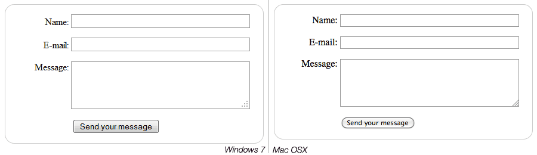

# Basic form styling

Now that you have finished writing your form's HTML code, try saving it and looking at it in a browser. At the moment, you'll see that it looks rather ugly.

<p align="center">
	
</p>

Forms are notoriously tricky to style nicely. It is beyond the scope of this article to teach you form styling, so for the moment we will just get you to add some CSS to make it look OK.

First of all, add a `<style>` element to your page, inside your HTML `head`.
It should look like so:

```html
<style>

</style>
```

Inside the style tags, add the following CSS, just as shown:
```html
form {
  /* Just to center the form on the page */
  margin: 0 auto;
  width: 400px;
  /* To see the outline of the form */
  padding: 1em;
  border: 1px solid #CCC;
  border-radius: 1em;
}

form div + div {
  margin-top: 1em;
}

label {
  /* To make sure that all labels have the same size and are properly aligned */
  display: inline-block;
  width: 90px;
  text-align: right;
}

input, textarea {
  /* To make sure that all text fields have the same font settings
     By default, textareas have a monospace font */
  font: 1em sans-serif;

  /* To give the same size to all text fields */
  width: 300px;
  box-sizing: border-box;

  /* To harmonize the look & feel of text field border */
  border: 1px solid #999;
}

input:focus, textarea:focus {
  /* To give a little highlight on active elements */
  border-color: #000;
}

textarea {
  /* To properly align multiline text fields with their labels */
  vertical-align: top;

  /* To give enough room to type some text */
  height: 5em;
}

.button {
  /* To position the buttons to the same position of the text fields */
  padding-left: 90px; /* same size as the label elements */
}

button {
  /* This extra margin represent roughly the same space as the space
     between the labels and their text fields */
  margin-left: .5em;
}
```

<p align="center">
	
</p>

## Sending form data to your web server

The last part, and maybe the trickiest, is to handle form data on the server side. As we said before, most of the time an HTML Form is a convenient way to ask the user for data and to send it to a web server.

The `<form>` element will define where and how to send the data thanks to the `action` attribute and the `method` attribute.

But it's not enough. We also need to give a name to our data. Those names are important on both sides; on the browser side, it tells the browser which name to give each piece of data, and on the server side, it lets the server handle each piece of data by name.

To name the data in a form you need to use the `name` attribute on each form widget that will collect a specific piece of data. Let's look at some of our form code again:

```html
<form action="/my-handling-form-page" method="post"> 
  <div>
    <label for="name">Name:</label>
    <input type="text" id="name" name="user_name" />
  <div>
  <div>
    <label for="mail">E-mail:</label>
    <input type="email" id="mail" name="user_email" />
  </div>
  <div>
    <label for="msg">Message:</label>
    <textarea id="msg" name="user_message"></textarea>
  </div>

  ...
```

In our example, the form will send 3 pieces of data named `"user_name"`, `"user_email"`, and `"user_message"`. That data will be sent to the URL `"/my-handling-form-page"` using the `HTTP` `POST` method.